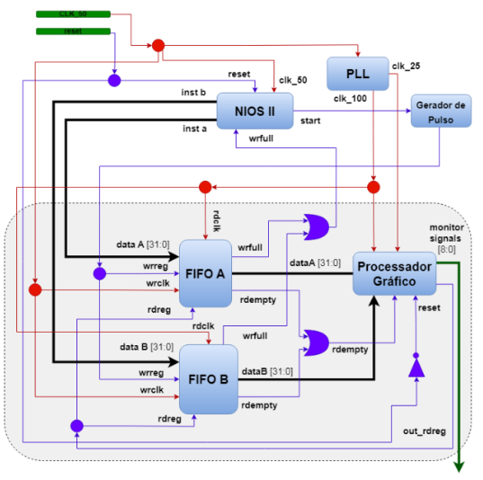

<h1 align="center"><i>Driver CoLenda</i></h1>

<h3 align="center">Comunicação com o dispositivo gráfico CoLenda</h3>

<p align="center">O Driver CoLenda é um driver de caractere simples e eficiente que realiza a comunicação entre o processador de
	propósito geral e o hardware. A biblioteca inclusa abstrai a comunicação entre aplicações de usuário e o driver</p>

<h4 align="center">
<a href="https://github.com/camilaqPereira/coLenda_driver/commits/main/"> </a>
<a href="https://github.com/camilaqPereira/coLenda_driver/pulls"> 
</a>
<a href="https://github.com/camilaqPereira/coLenda_driver">
</a>
</h4>

<div align="center">
	
[Sobre o projeto](README.md#sobre-o-projeto) • [Instalação](README.md#instalação) • [Solução geral](README.md#solução-geral) • [Driver](README.md#driver-colenda-1) •
[Biblioteca](README.md#biblioteca-colenda) • [Testes](README.md#produto-e-testes-realizados)

</div>

## Sobre o projeto

A Unidade de Processamento Gráfico (GPU) é um microprocessador especializado e paralelo dedicado à aceleração de computações gráficas. Este processador foi desenvolvido especificamente para a realização de diversas operações com valores de ponto flutuante, essenciais para o processamento de gráficos 2D/3D. Atualmente, as GPUs, além de serem potentes dispositivos gráficos, são processadores paralelos altamente programáveis que apresentam alta precisão e poderosos recursos.

Neste contexto de grande evolução das unidades de processamento gráfico e de crescente popularidade destas mesmas, o presente projeto objetiva o desenvolvimento de um módulo kernel para o processador gráfico CoLenda, além de uma biblioteca que facilitea utilização do driver, em uma plataforma de desenvolvimento de hardware. O Kit de desenvolvimento DE1-SoC foi selecionado para o desenvolvimento e teste do produto.

<details>
<summary> <h3 style="font-weight: bold">Requisitos</h3></summary>
	
A solução deve atender às condições e aos requisitos predeterminados, de modo que:
- o código deve ser escrito na linguagem C
- a biblioteca deve conter, no mínimo, uma função para cada instrução do processador gráfico
- a biblioteca deve seguir as recomendações descritas em [C coding style por Tilen Majerle](https://github.com/MaJerle/c-code-style)

</details>

## Contribuidores

<a href="https://github.com/brendabo1"></a>
<a href="https://github.com/camilaqPereira"></a>
<a href="https://github.com/DestinyWolf"></a>

<details>
<summary><h2>Índice</h2></summary>

- [Instalação](#instalação)
	-  [Pré-requisitos](#pré-requisitos)
-  [Softwares utilizados](#softwares-utilizados)
	- [Linguagem C](#linguagem-c)
	- [Compilador GNU](#compilador-gnu)
 	- [VS Code](#vs-code)
- [DE1-SoC](#kit-de-desenvolvimento-de1-soc)
	- [Visão geral da DE1-SoC](#visão-geral-da-de1-soc)
  	- [Sistema computacional da placa](#sistema-computacional-de1-soc)
- [Processador gráfico](#processador-gráfico)
- [Solução geral](#solução-geral)
- [Driver CoLenda](#driver-colenda)
- [Biblioteca CoLenda](#biblioteca-colenda)
	- [Constantes de sprites](#constantes-de-sprite)
 	- [Structs](#structs)
  	- [Funções](#funções)
  	- [Pseudo-instruções](#pseudo-instruções)
  	- [Funções internas auxiliares](#funções-internas-auxiliares)
  	- [Validação de valores](#validação-de-valores)
 
</details>

## Instalação
<details>
<summary><h3>Pré-requisitos</h3></summary>

- Possuir conexão com internet;
- Possuir instalado o compilador gcc;
- Possuir instalado o Git ;
- Utilizar uma placa de desenvolvimento FPGA DE1-SoC;
- Possuir o processador gráfico CoLenda na FPGA
- Possuir um monitor conectado à placa por meio da saída VGA

</details>

#### 1. Clonar o repositório
Abra o terminal do seu dispositivo e execute o seguinte comando:
```
git clone https://github.com/camilaqPereira/coLenda_driver.git
```
#### 2.Acessar a pasta */source/driver* e compilar o driver
Para acessar a pasta */source/driver* e compilar o módulo kernel, basta executar os seguintes comandos:
```
cd /source/driver
```

```
make all
```
#### 3. Executar o script de carregamento do driver
Execute o comando:
```
sudo ...
```

## Softwares utilizados

<details>
<summary> <b>Linguagem C</b> </summary>

### Linguagem C

É uma linguagem de programação de propósito geral que combina abstrações e controles de baixo nível sobre o hardware resultando em ganho de eficiência. O software criado em 1970 por Dennis Ritchie é estreitamente associada ao sistema operacional UNIX, uma vez que as versões desse sistema foram escritas em linguagem C. Além disso, a sintaxe simples e a alta portabilidade desta linguagem entre dispositivos contribui para seu amplo uso em sistemas embarcados de recursos limitados.

</details>

<details>
<summary> <b>Compilador GNU</b> </summary>

### Compilador GNU

O GNU Compiler Collection GCC (Coleção de Compiladores GNU), ou GCC, é um conjunto de compiladores de código aberto desenvolvido pelo Projeto GNU que oferecem suporte a uma gama de linguagens de programação, incluindo C, C++, Fortran, Ada e Go. Esta ferramenta otimiza a compilação, ou seja a produção de código de máquina, nas várias linguagens e arquiteturas de processadores suportadas.

</details>
<details>

<summary> <b>VS Code</b> </summary>

### VS Code

O Visual Studio Code, ou VS Code, é um editor de texto gratuito com suporte a várias linguagens de programação, incluindo Python, Java, C, C++ e JavaScript. A ferramenta desenvolvida pela Microsoft Corporation dispõe de diversos recursos de depuração, destaque de erros, sugestões, personalização dentre outros para auxiliar a codificação.

</details>

## Kit de desenvolvimento DE1-SoC

<details>
<summary><b>Visão geral da DE1-SoC</b></summary>

### Visão geral da DE1-SoC

Equipado com processador, USB, memória DDR3, Ethernet e uma gama de periféricos, o kit de desenvolvimento DE1-SoC (Figura 1) integra no mesmo Cyclone® V da Intel®, sistema em chip (SoC), um *hard processor system* (HPS) a uma FPGA (*Field Programmable Gate Arrays*). Este design permite uma grande flexibilidade da placa nas mais variadas aplicações. Para o acesso ao sistema operacional Linux embarcado na placa, o protocolo de rede SSH *(Secure Shell)* foi utilizado, estabelecendo uma conexão criptografada para comunicação entre a placa e computador *host*.

<div align="center">
  <figure>  
    
    <figcaption>
      <p align="center"><b>Figura 1</b> - Kit de Desenvolvimento DE1-SoC</p>
      <p align="center">Fonte: Terasic Technologies</p>
    </figcaption>
  </figure>
</div>

</details>

<details>
<summary><b>Sistema computacional DE1-SoC</b></summary>

### Sistema computacional DE1-SoC

<div align="center">
  <figure>  
    
    <figcaption>
      <p align="center"><b>Figura 2</b> - Diagrama de Blocos da DE1-SoC</p>
      <p align="center">Fonte: FPGAcademy.org</p>
    </figcaption>
  </figure>
</div>

O diagrama de blocos do sistema computacional, apresentado na figura 2,  explicita os componentes do Cyclone® V da Intel®, bem como suas conexões. O HPS inclui um processador ARM® Cortex-A9 MPCore™ de 2 núcleos com uma distribuição Linux embarcada destinada a processamentos de propósito geral,  além da memória DDR3 e dos dispositivos periféricos. Já a FPGA possibilita uma variedade de implementações através da programação dos blocos lógicos.


> A comunicação bidirecional entre a o HPS e a FPGA se dá por meio das *FPGA bridges*. 
> No sentido HPS-FPGA, todos os dispositivos de entrada e saída (E/S) conectados à FPGA são acessíveis ao processador através do mapeamento de memória.
> As informações sobre o endereçamento dos periféricos estão disponíveis na [documentação da placa](https://fpgacademy.org/index.html).

</details>

## Processador gráfico


Foi utilizada a GPU CoLenda que esta localizada na parte da FPGA disponivel na placa DE1-SoC. Esta placa de video foi desenvolvida pelo discente Gabriel Sá Barreto Alves Como parte do seu projeto de TCC.  A GPU conta com um conjunto de Instruções que permitem alterar a cor do fundo, alterar blocos de background, desenhar sprites e polígonos, além de permitir a criação de sprites próprios.

<details>
	<summary><b>Instruções</b></summary>

 ### Instruções
|       Sigla         |            Instrução                      |
|        ---          |              -----------                  |
|        WBR          |        Escrita no banco de registradores  |
|        WSM          |        Escrita na memória de sprites      |
|        WBM          |        Escrita na memória de backgroung   | 
|        DP           |        Definição de um polígono           |
</details>
a comunicação com a gpu é feita através dos dois barramentos de dados que a mesma possui, sendo o data A para acesso à memória, códigos de operações e registradores e o barramento data B para os demais dados.

Alem disso a GPU retorna quando a fila de instruções está cheia e quando uma tela foi, por fim, renderizada.

Abaixo segue o diagrama da GPU utilizada


<p><b>Figura 3</b> - Diagrama interno da GPU</p>
<p>Fonte: TCC Gabriel Barreto</p>


## Solução geral

<div align="center">
  <figure>  
    
    <figcaption>
      <p align="center"><b>Figura 3</b> - Esquema em blocos da solução geral </p>
      <p align="center">Fonte:Elaboração própria</p>
    </figcaption>
  </figure>
</div>

O produto desenvolvido implementa a intercomunicação entre o software e o dispositivo gráfico CoLenda. O fluxo de comunicação entre a
aplicação de usuário, o módulo kernel e o hardware é esquematizado na figura 3. O fluxo de comunicação inicia-se com a aplicação do
usuário que, por meio dos recursos disponibilizados pela biblioteca CoLenda tais como estruturas e funções, gerencia os dados
dos elementos a serem exibidos no monitor e as chamadas das respectivas funções da *lib* para realizar as exibições na tela.

Por sua vez, a biblioteca atua como uma mediadora entre a aplicação de usuário e o driver CoLenda, gerenciando as chamadas de sistema
necessárias e a conversão das solicitações recebidas para o stream de bit compreensível pelo driver.
Por fim, o driver gerencia os sinais de entrada e saída do hardware diretamente pelo seu barramento de dados a fim de enviar as
instruções recebidas da biblioteca.


## Driver CoLenda

Existem dois modos de operação referentes ao modo de execução do processador: modo núcleo ou modo kernel e modo usuário. O kernel é parte do sistema operacional que tem acesso completo a todo o hardware e recursos, podendo executar qualquer instrução disponível na máquina. Portanto, o modo kernel possui privilégios de acesso e execução de subsistemas. Já o modo usuário possui  limitações e menos privilégios. 
A figura 4 exibe uma típica arquitetura do sistema operacional linux, onde o espaço kernel intermedia o acesso e o compartilhamento dos recursos de hardware, de maneira segura e justa, entre multiplas aplicações (ref kernel labs). A janela de intereção entre o espaço de usuário e do kernel se dá através de uma interface de chamadas de sistema em que, em mais alto nível, o kernel prove "serviços" às aplicações.

<div align="center">
  <figure>  
    
    <figcaption>
      <p align="center"><b>Figura 4</b> - Esquema em blocos da arquitetura típica de sistemas operacionais (adaptado)</p>
      <p align="center">Fonte:</p>
    </figcaption>
  </figure>
</div>

<div align="center">
  <figure>  
    
    <figcaption>
      <p align="center"><b>Figura 5</b> - Esquema em blocos d (adaptado)</p>
      <p align="center">Fonte:</p>
    </figcaption>
  </figure>
</div>

## Biblioteca CoLenda

A biblioteca desenvolvida provê uma abstração da comunicação com o driver de dispositivo, facilitando a interação do usuário com o 
módulo kernel do hardware. Esta *lib* disponibiliza constantes para a seleção de sprites, estruturas para a organização dos elementos a
serem exibidos, funções respectivas às instruções do processador gráfico e pseudo-instruções, tal como *clear*, que executam conjuntos de instruções.
> [!NOTE]
> Os sprites disponíveis para seleção estão salvos em hardware no processador gráfico.
> Nenhum deles foi criado pela biblioteca

> [!NOTE]
> As pseudo-instruções são funções da biblioteca que podem ser chamadas

<details >
<summary><b>Constantes de sprite</b></summary>

### Constantes de sprite
As constantes de sprite implementadas visam facilitar a escolha do sprite, pois abstraem o número relacionado ao endereço em que um sprite específico está localizado.

| Define    | Valor    | sprite associado
|-----------|----------|-------------------
| ORANGE_BLOCK  | 0     | bloco laranja
| BLUE_BLOCK  	| 1     | bloco azul
| MEDAL			| 2		| medalha
| BOMB 			| 3		| bomba
| TREE			| 4 	| arvore
| SHIP_UP 		| 5 	| nave virada para cima
| SHIP_RIGTH 	| 6 	| nave virada para direita
| SHIP_DOWN		| 7		| nave virada para baixo
| SHIP_LEFT		| 8 	| nave virada para esquerda
| COIN			| 9		| moeda
| DIAMOND		| 10	| diamante
| LASER_VERTICAL| 11 	| laser na vertical
| LASER_DIAGONAL1| 12 	| laser na diagonal principal
| LASER_HORIZONTAL| 13 	| laser na horizontal
| LASER_DIAGONAL2| 14 	| laser na diagonal secundária
| HEART			| 15	| coração azul
| LOG			| 16	| tronco de arvore
| BLUE_CAR		| 17	| carro de corrida azul
| GREEN_CAR		| 18	| carro de corrida verde
| PURPLE_CAR	| 19	| carro de corrida roxo
| YELLOW_CAR	| 20	| carro de corrida amarelo
| ALIEN1		| 21	| alien do space invaders
| ALIEN2		| 22	| alien do space invaders
| DRAGON		| 23	| pedra
| CUP			| 24	| troféu

a baixo segue as imagens dos sprites que estão na memporia


<p><b>Figura x</b> - tabela com os sprites pre-renderizados na gpu</p>
<p>Fonte: Arquivo auxiliar disponibilizado pelos professores</p>

</details>

<details>
<summary><b>Structs</b></summary>

### Structs

| Struct      | Descrição | Atributos |
| ---- | ----------- | ----------- |
| Cor      | Define os campos que uma cor deve possuir. Utilizada nas demais estruturas que necessitam de um campo de cor| Vermelho, verde e azul |
| Sprite   | Define os dados necessários para a exibição de um sprite        | Coordenadas x e y, offset (para a escolha do sprite), registrador (espaço de memória que será ocupado) e visibilidade |
| Bloco de background   | Agrupa as informações necessárias para a edição de um bloco de blockground | Cor (struct) e coordenadas x e y  |
| Pixel   | Define as informações necessárias para a criação de um pixel de um sprite. Localizado na memória de sprites      | Endereço de memória e cor (struct) |
| Polígono   | Agrupa as informações necessárias para a exibição de um polígono   | Coordenadas x e y, camada, tamanho, forma (triângulo ou quadrado e cor (struct) |


<blockquote>

**NOTE**

As coordenadas de sprites são relativas a disposição dos pixels na tela (640x480). Já as coordenadas dos blocos de blackground são relativas à disposição dos blocos de tamanho 8x8 pixels (totalizando 80x60 blocos). Cada bloco possui um endereço na memória 
</blockquote>

</details>

<details >
<summary ><b>Funções</b></summary>

### Funções 
	
|      Função          |          Argumento         | Instrução relacionada |
|     -----------      |        -----------         |           ----        |
|   Setar pixel        |         Struct pixel       |           WSM         |
|  Setar cor de fundo  |         Struct cor         |           WRB         |
| Setar bloco de fundo | Struct bloco de background |           WSM         |
|    Setar sprite      |       Struct sprite        |           WRB         |
|    Setar polígono    |      Struct polígono       |           DP          |
	
</details>

<details>
<summary ><b>Pseudo-instruções</b></summary>
	
### Pseudo-instruções 
	
| Função | Descrição | Argumento |
|  -----------  | ----------- |----------- |
| Desenhar linha vertical | Desenha uma linha vertical utilizando blocos de background. Chama a função setar bloco de background n vezes alterando apenas a coordenada y | Coordenadas iniciais x e y, tamanho (n) e  cor (struct)|
| Desenhar linha horizontal | Desenha uma linha horizontal utilizando blocos de background. Chama a função setar bloco de background n vezes alterando apenas a coordenada x | Coordenadas iniciais x e y, tamanho (n) e  cor (struct)|
| Desenhar bloco de background | Seta um bloco de background. Dispensa a instância da struct| Coordenadas iniciais x e y, e cor (struct)|
| Clear | Reseta a tela| - |

</details>

<details >
<summary><b>Funções internas  auxiliares</b></summary>

### Funções internas auxiliares

- função para escrever no buffer do driver as instruções (gerencia a chamada de sistema write)
- função para transformar 2 wchar_t em uma string de 8 char

</details>

<details >
<summary ><b>Validação de valores</b></summary>

###  Validação de valores e tratamento de erros

A biblioteca apresenta recursos para validação dos valores inseridos pelo usuário, pois como as instruções possuem tamanhos e campos distintos, foi imprescindível a existência de recursos para validar essas informações. A detecção de um erro retorna um valor de erro à aplicação do usuário  e exibe no terminal o erro uma mensagem referente ao erro ocorrido

</details>	

## Exemplos
Apesar do número limitado de elementos disponibilizados pelo processador gráfico, uma vasta gama de imagens podem ser renderizadas. Um exemplo de imagem que pode ser criada
é mostrada na figura 4 na qual foram utilizados todos os recursos do hardware:
- polígonos: usados para desenhar os botões direitos do gameboy
- cor de background: definido para branco
- blocos de background: usados para desenhar o corpo, a tela e os botões esquerdos do gameboy
- sprites: usados para criar o cenário na tela do gameboy

As pseudo instruções foram todas utilizadas para facilitar o desenvolvimento da imagem. O código para a renderização da imagem encontra-se [aqui](source/Lib/gameboy_example.c).

<div align="center">
  <figure>  
    
    <figcaption>
      <p align="center"><b>Figura 4</b> - Imagem exibida no monitor</p>
      <p align="center">Fonte: Elaboração própria</p>
    </figcaption>
  </figure>
</div>

>[!TIP]
> Loops e alteração da posição dos elementos podem ser usadas para criar imagens dinâmicas!

> [!TIP]
> Como a GPU aceita cores no formato RGB de 9 bits, utilize a tabela de cores disponível
> [aqui](arquivos_complementares/9-bit-rgb-palette.html) para falicitar a seleção das cores a serem usadas na sua imagem.

## Testes

Testar a exibição dos recursos da GPU no monitor é verificar que a biblioteca CoLenda realiza a montagem correta das instruções a serem
passadas para o driver, bem como o gerenciamento correto das chamadas de sistema. É verificar também que o módulo kernel CoLenda realiza
o mapeamento adequado do barramento de dados do harware, assim como o gerenciamento preciso dos sinais de controle do processador para a
exibição dos elementos na tela.

Este processo consiste na instanciação das structs dos elementos, chamada das respectivas funções de exibição e conferência dos dados
obtidos na tela.  

<details>
	<summary><b>Teste background e limite máximo de posição polígono</b></summary>

## Teste de background e limite máximo de posição polígono
Neste caso, o trecho de código abaixo foi utilizado e, como resultado, espera-se que a cor de fundo seja definida para branco e um
triângulo preto de tamanho 20x20 seja exibido na posição (511, 240). Como observa-se na figura 5, os devidos elementos foram setados com as configurações corretas. 

```C
// inicia a comunicação com o driver
GPU_open();

//Instanciação de structs
color_t white = {7,7,7};
color_t black = {0, 0, 0};

polygon_t black_triangle = {511,240, 0, 1, 1, black};

//seta a cor de fundo do background
set_background_color(white);

//seta o polígono
set_polygon(black_triangle);

//encerra a comunicação com o driver
GPU_close();
```

<div align="center">
  <figure>  
    
    <figcaption>
      <p align="center"><b>Figura 5</b> - Resultado do teste no monitor</p>
      <p align="center">Fonte: Elaboração própria</p>
    </figcaption>
  </figure>
</div>

<blockquote>

**WARNING**

O tamanho do campo coordenada x da instrução DP (9 bits) restringe as posições que os polígonos
podem ocupar. O triânguloda figura 5 ilustra a posição limite, no eixo x, que os polígonos podem 
ocupar. 

</blockquote>
 
</details>

<details>
<summary><b>Teste de limite mínimo de posição polígono</b></summary>

### Teste de limite máximo de posição polígono
Neste caso, o mesmo trecho de código da seção anterior foi utilizado  alterando-se apenas as coordenas x e y do polígono. Como resultado, esperava-se que a cor de fundo fosse definida para branco e um triângulo preto de tamanho 20x20 fosse exibido na posição 
(10, 10). Como observa-se na figura 6, o 
triângulo não foi setado corretamente. O teste foi repetido com o quadrado e o erro persistiu (figura 7). 
Após diversas análises e múltiplos testes, concluiu-se que o erro pertence à GPU. Todos os polígonos cujas coordenadas x e/ou y sejam menores que metade do tamanho do polígono não são exibidos ou sua exibição assume um tamanho aleatório devido a erros nos cálculos.

<div align="center">
  <figure>  
    
    <figcaption>
      <p align="center"><b>Figura 6</b> - Resultado do teste com triângulo no monitor</p>
      <p align="center">Fonte: Elaboração própria</p>
    </figcaption>
  </figure>
</div>

<div align="center">
  <figure>  
    
    <figcaption>
      <p align="center"><b>Figura 7</b> - Resultado do teste com quadrado no monitor</p>
      <p align="center">Fonte: Elaboração própria</p>
    </figcaption>
  </figure>
</div>
	
</details>


<details>
<summary><b>Teste com blocos de background</b></summary>

### Teste com blocos de background
Neste caso, o trecho de código abaixo foi utilizado para testar os limites de representação dos blocos de background. Como resultado, esperava-se que um erro ocorresse o que não aconteceu.
Novos testes foram repetidos e, a partir disto, concluiu-se que o endereçamento dos blocos de background contem 13 bits, ao invés dos 12 especificados na documentação. Na figura 8, estão destacados todos os blocos de background que não seriam abrangidos caso o endereçamento tivesse 12 bits. 

```C
// inicia a comunicação com o driver
GPU_open();

//Instanciação de structs
color_t blue = {0, 0, 3};

//Seta bloco de background
draw_background_block(70,57, blue);
//encerra a comunicação com o driver
GPU_close();
```

<div align="center">
  <figure>  
    
    <figcaption>
      <p align="center"><b>Figura 7</b> - Resultado do teste dos limites de representação dos blocos de background no monitor</p>
      <p align="center">Fonte: Elaboração própria</p>
    </figcaption>
  </figure>
</div>
</details>

## Conclusão
Apos diversos testes foi concluído que tanto o drive quanto a biblioteca atenderam aos objetivos esperados, e desempenharam de maneira satisfatória ao que foi proposto. Durante os testes foi notado um possível problema com relação a fila de instrução ficar lotada, para isso foi implementado um delay a cada 12 instruções na biblioteca, como melhoria futura, pode-se implementar alguma alternativa no drive para que não fique tão dependente da biblioteca e consiga por si só, lidar com problemas de mesmo cunho.

## Referências
TANENBAUM, A. S.; BOS, Herbert. Sistemas operacionais modernos. 4. ed. São Paulo: Pearson Education do Brasil, 2016. Acesso em: 2 maio. 2024.
